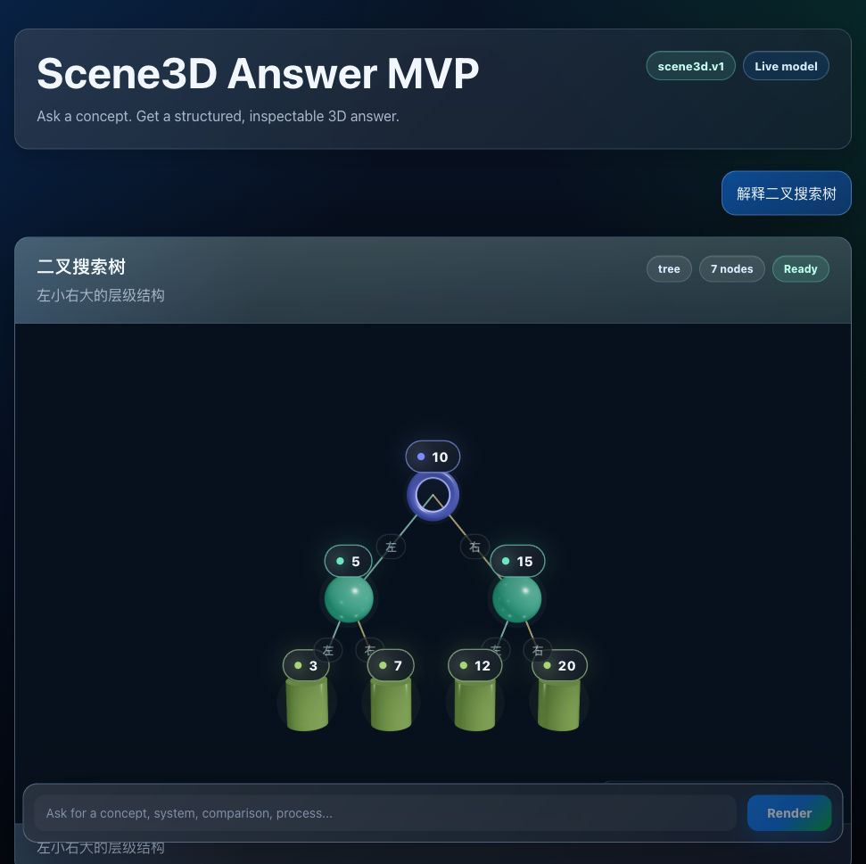
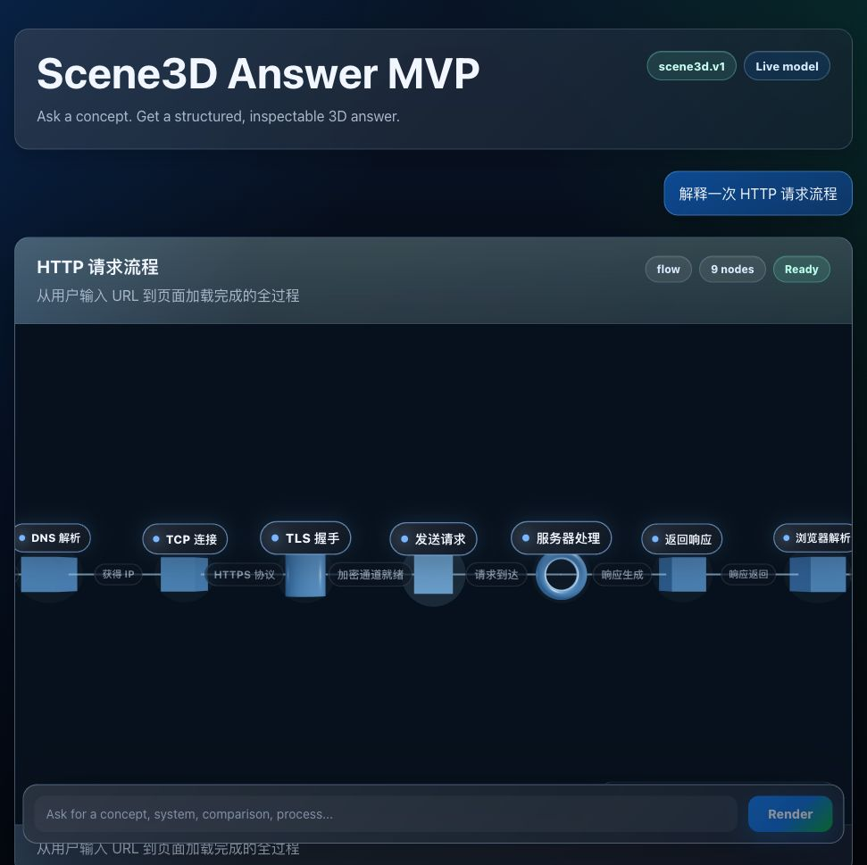
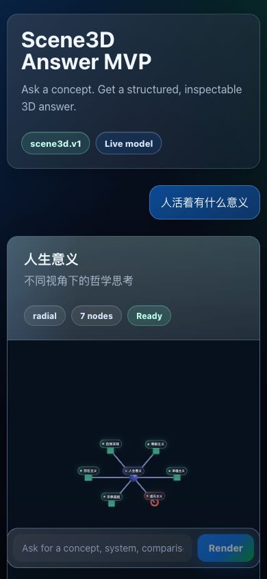

# Scene3D Answer MVP

Scene3D Answer MVP 是一个用大模型生成 `scene3d.v1` 结构化答案，并把答案渲染成可交互 3D 知识卡片的 Web 应用。

用户输入一个概念、系统、流程或开放问题后，后端调用 DeepSeek 生成结构化 JSON，前端用 React + Three.js/R3F 渲染为 `radial`、`tree` 或 `flow` 三类 3D 场景。

## Live Demo

[https://scene3d-answer.vercel.app](https://scene3d-answer.vercel.app)

## Screenshots

### 毛玻璃 3D 知识树



### HTTP 请求流程



### 移动端效果



## Features

- 支持自然语言提问，并生成简体中文的标题、节点、描述和边标签。
- 支持三种 3D 场景模板：`radial`、`tree`、`flow`。
- 支持拖拽旋转、滚轮缩放、点击节点查看详情。
- 后端校验模型输出的 `scene3d.v1` JSON，避免前端执行模型生成代码。
- API key 只保存在服务端 `.env`，浏览器不会拿到密钥。
- 后端请求直接使用 Node 原生 `fetch`，不使用 PowerShell。

## Tech Stack

- React 18
- Vite
- TypeScript
- Three.js / React Three Fiber
- Zod
- DeepSeek Chat Completions API

## Run

```bash
npm install
copy .env.example .env
npm run dev
```

默认本地地址：

```text
http://127.0.0.1:5175/
```

## Environment

`.env` 示例：

```env
AI_PROVIDER=deepseek
DEEPSEEK_API_KEY=sk-your-deepseek-key
DEEPSEEK_MODEL=deepseek-v4-flash
```

也可以切换到 OpenAI：

```env
AI_PROVIDER=openai
OPENAI_API_KEY=sk-proj-your-openai-key
OPENAI_MODEL=gpt-4.1-mini
```

`.env` 已经被 `.gitignore` 忽略，不要把真实 API key 提交到 GitHub。

## Manual Prompts

- `react setState 原理` 会生成 `flow` 流程图。
- `人活着有什么意义` 会生成 `radial` 概念图。
- `解释二叉搜索树` 会生成 `tree` 层级结构。
- `解释一次 HTTP 请求流程` 会生成 `flow` 请求链路。

## Verify

```bash
npm test
npm run build
npm run lint
```

当前验证覆盖：

- `scene3d.v1` schema 校验
- 3D layout 计算
- DeepSeek/OpenAI 请求构造
- 模型输出解析
- `/api/scene-answer` Node middleware
- 聊天输入和 fallback 逻辑

## Architecture

```text
Browser
  -> POST /api/scene-answer
  -> Vite Node middleware
  -> DeepSeek Chat Completions
  -> scene3d.v1 JSON validation
  -> React scene renderer
```

前端只负责展示和交互；后端负责调用模型、校验 JSON、保护 API key。

## Security Notes

- 不在浏览器端调用模型 API。
- 不把 API key 注入前端 bundle。
- 不执行模型生成的 JavaScript、HTML、CSS 或 Three.js 代码。
- 只接受通过 Zod 校验的 `scene3d.v1` 数据。
